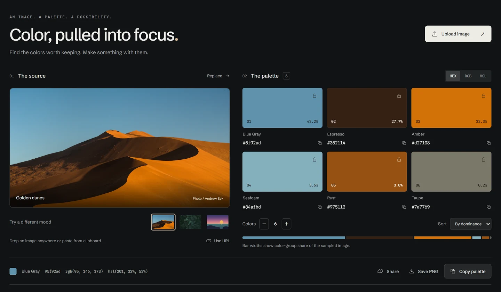
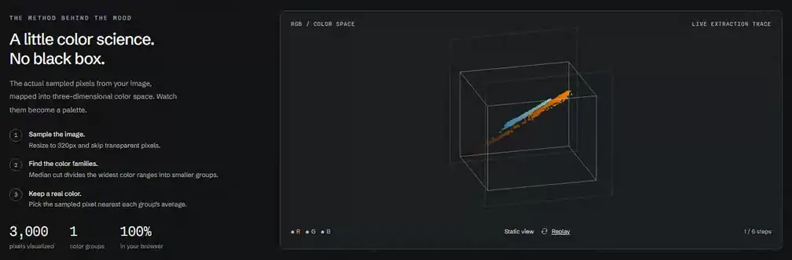
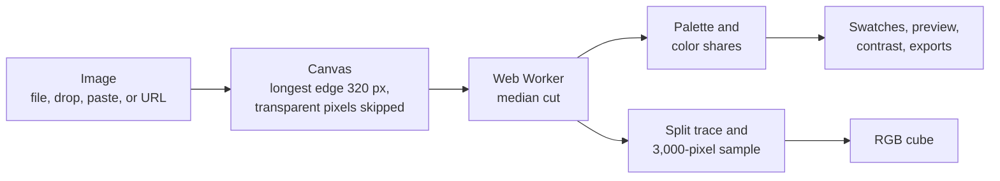

# Palette Extractor

[](https://github.com/samalbanese/palette-extractor/actions/workflows/ci.yml)
[](LICENSE)

**Color, pulled into focus.** A private color studio that takes an image from inspiration to usable design values. Upload a photo, explore its palette, see it applied to an identity, and take the colors straight into your next project.

[Open the live app](https://palette-extractor.samalbanese.workers.dev/)



## Explore the palette

- **Start immediately.** Three bundled sample moods demonstrate the tool without an upload.
- **Bring your own image.** Upload, drop a file anywhere, paste an image, or load a public image URL.
- **Find and keep your colors.** Request 4–10 colors, pin favorites while re-extracting around them, sort by hue or lightness, and copy HEX, RGB, or HSL values.
- **Understand the balance.** A distribution strip and percentages show each quantized color group's share of the sampled image. Pinned palettes deliberately hide distribution, since their colors may come from different images.
- **See it in context.** An editorial identity responds to the palette, with suggested surface, text, and accent roles. Reverse light and dark to explore another direction. Low-contrast palettes get an honest explanation instead of an unreadable preview.
- **Check readability.** Compare actual WCAG 2 contrast ratios and copy a text/background pair as CSS. Large-text-only pairs are labeled separately.
- **Watch the algorithm.** A live RGB cube plots up to 3,000 sampled pixels and animates median-cut partitions.
- **Take it with you.** Preview, copy, or download CSS variables, Tailwind v4 theme tokens, SCSS, SVG, or JSON. Save a PNG palette card or share a compact color-only link, including one-color palettes.

## How it works





### Engineering decisions

- **Quantize off the main thread.** Each extraction runs in its own Web Worker, so the interface stays responsive on large photos. The downscaled canvas's raw pixel buffer is transferred to the worker rather than copied, and the worker filters and collects pixels itself, so the main thread only draws and hands off. When a newer image or setting supersedes a run, an `AbortController` terminates its worker, and a request counter discards stale URL loads. A failed upload leaves the last good palette in place.
- **Sample small, on purpose.** The image is drawn to a canvas with a longest edge of 320 px. That size came from benchmarking: 512 px took about four times as long with no visible gain, while 160 px let downscaling blur fine details into colors that were not in the photo.
- **Median cut, written from scratch.** There is no quantization library. Early splits go to the most populous box, which finds the dominant colors. The final quarter of splits weighs population by box volume in RGB space, which rescues small but distinct accents that population alone would ignore.
- **Cut between clusters, not through them.** Instead of splitting exactly at the median, the cut point moves toward the middle of the wider side of the range, which tends to land in the gap between two color clusters.
- **Only real colors.** A box's average can fall between two clusters and invent a color that appears nowhere in the image. Each swatch is instead the sampled pixel nearest its box's average, and a regression test holds that line.
- **Pinning re-extracts around your picks.** Pinned colors stay put, and pixels close to them in RGB space are excluded before the remaining swatches are found, so the new picks are genuinely different.
- **Visualize the real run.** The worker returns the actual split sequence along with a pixel sample, so the RGB cube replays the run that produced your palette rather than a canned illustration. It respects reduced-motion preferences and pauses while off screen.

Swatches are colors from the downscaled sample, and resizing can blend neighboring pixels. Quantization is an approximation, and a simple image may return fewer colors than requested.

## Performance

| Measure                                 | Result                                                                                                    |
| --------------------------------------- | --------------------------------------------------------------------------------------------------------- |
| 12 MP photo, upload to rendered palette | ~0.4 s median, ~0.8 s with 4× CPU throttling                                                              |
| JavaScript, gzipped                     | 60 kB including React at first load; the other tool panels load on demand (4 kB) and the worker adds 1 kB |
| CSS, gzipped                            | 7 kB                                                                                                      |
| Lighthouse, desktop (live site)         | Performance 100 · Accessibility 100 · Best practices 100 · SEO 100                                        |
| Lighthouse, mobile (production build)   | Performance 92 · Total blocking time 92 ms · Largest paint 2.7 s                                          |

Extraction timings come from the production build in Chromium on an AMD Ryzen 7 5800X3D. Mobile Lighthouse figures are the median of four runs with DevTools throttling (slow 4G, 4× CPU slowdown); the build before the pixel work moved into the worker scored 85, 191 ms and 3.6 s on the same setup.

## Project structure

```
src/
  App.tsx            Page layout; composes the hooks below
  hooks/             Image loading, palette state, copy feedback, shared links
  components/        Swatches, contrast, identity preview, exports, RGB cube
  lib/               Framework-free logic: median cut, worker entry, color
                     math, contrast, exporters, color names, share encoding
tests/
  studio.spec.ts     End-to-end browser tests
```

## Quality checks

Every push and pull request runs [CI](.github/workflows/ci.yml): a formatting check, type checking, 48 unit tests, a production build, and 12 end-to-end browser scenarios in Chromium.

Unit tests cover the quantizer, color math, contrast, exporters, color names, share links, and theme roles. Browser tests exercise uploads, drag and paste, URL loading, copy formats, downloads, sharing, pinning, keyboard tabs, reduced motion, and responsive layouts, with automated axe accessibility scans at phone, tablet, and desktop widths.

## Privacy and architecture

React 18, TypeScript, Vite, hand-written CSS, Canvas, and Web Workers. No runtime dependencies beyond React. No accounts, backend, database, API keys, or analytics. Bundled images and self-hosted fonts mean the default experience makes no external requests.

Local uploads never leave the browser. **Public image URLs are different:** they are fetched from their host and, when direct cross-origin loading fails, through the `images.weserv.nl` proxy. Shared links contain the color values only, never the source image.

## Run locally

Node.js 20 or later (22+ recommended).

```sh
npm ci
npm run dev          # local dev server
npm test             # unit tests
npm run typecheck
npm run format       # apply Prettier
npm run build        # production files in dist/
```

Browser tests:

```sh
npx playwright install chromium
npm run test:e2e
```

To reuse an installed Chromium browser, set `PLAYWRIGHT_CHROMIUM_EXECUTABLE` to its full executable path. Production files can be deployed to any static host, including Cloudflare Pages or Workers Static Assets.

## License

[MIT](LICENSE)

## Credits

Sample photography: [Andrew Svk](https://unsplash.com/photos/0s9oD70F-l4) and [Domenico Gentile](https://unsplash.com/photos/N7Q0Ir-hXeA), under the [Unsplash License](https://unsplash.com/license). The coastal illustration is included in this repository. Schibsted Grotesk and Spline Sans Mono are self-hosted under the SIL Open Font License; license files are in `public/fonts/`.

The base CSS reset is adapted from [Tailwind CSS preflight](https://github.com/tailwindlabs/tailwindcss) (MIT). Contrast guidance follows [W3C's WCAG contrast criteria](https://www.w3.org/WAI/WCAG22/Understanding/contrast-minimum.html). A color-pair check does not certify an entire design's accessibility.
